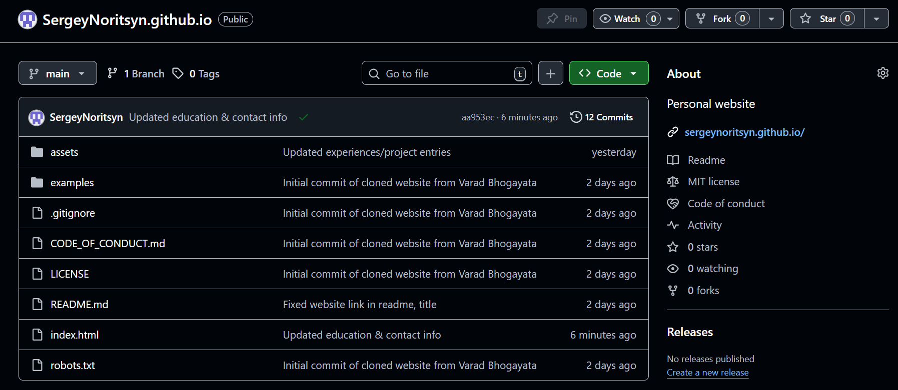
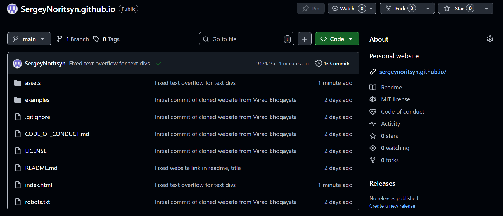
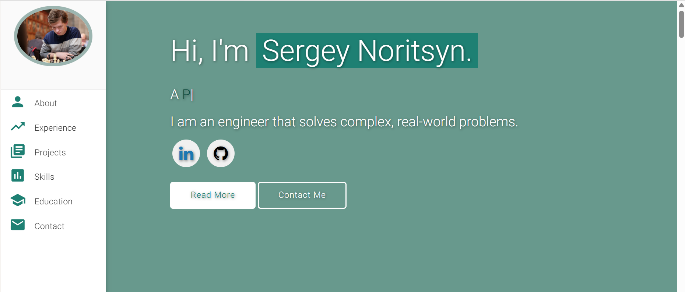
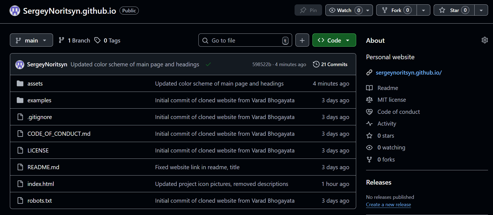
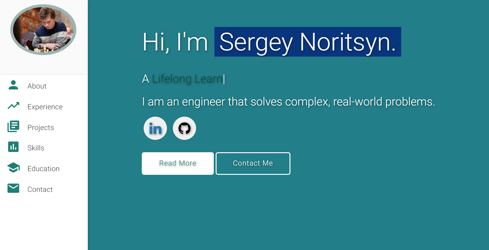
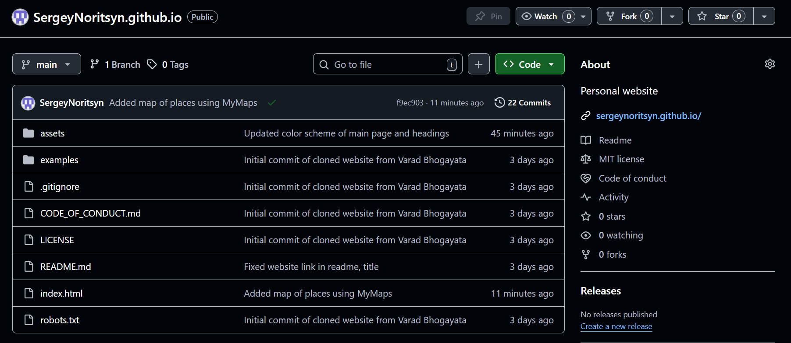
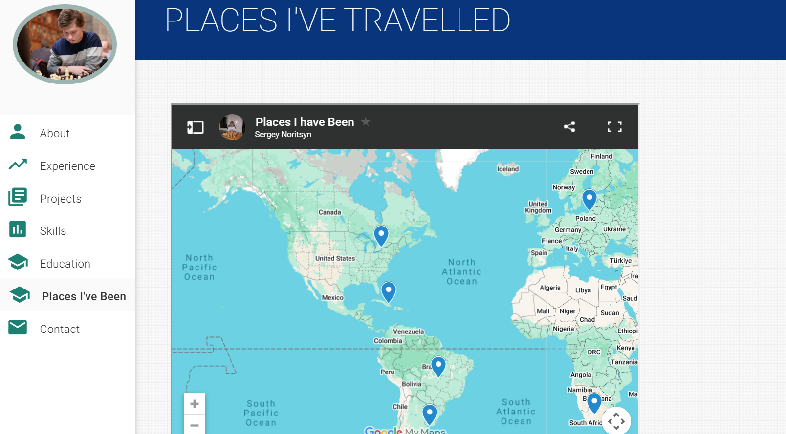
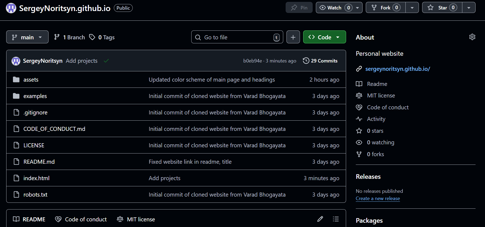
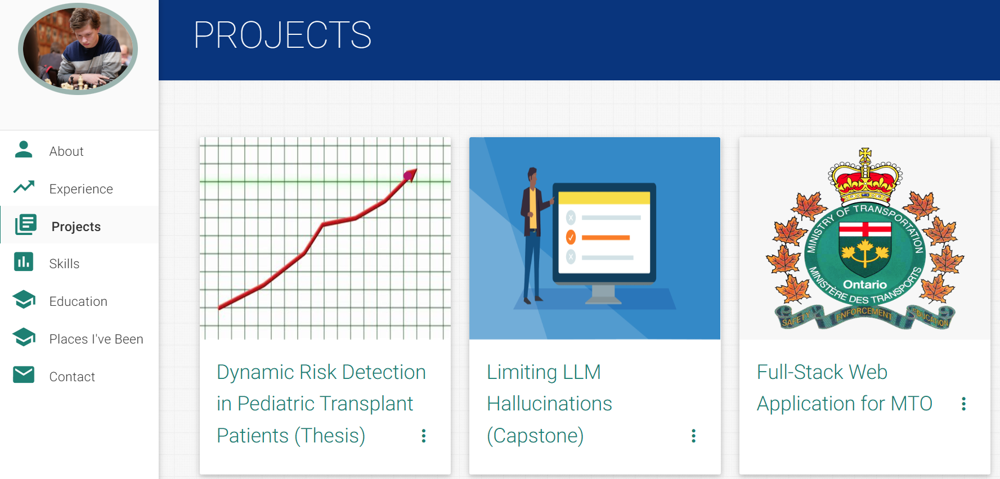

# Personal Portfolio ⚡️ 
> https://SergeyNoritsyn.github.io

 

### Required Lab Practical Screenshots

Part 1 - Cloning repo

Part 2 - Filling in info

Part 3 - Update theme

Part 4 - Adding Places Map

Part 5 - Adding projects dynamically

### Website Preview

 
  <kbd>
    
  </kbd>

## Features 📋
⚡️ Fully Responsive\
⚡️ Valid HTML5 & CSS3\
⚡️ Typing animation using `Typed.js`\
⚡️ Easy to modify

## Sections 📚
✔️ About me\
✔️ Experience\
✔️ Projects \
✔️ Skills \
✔️ Education\
✔️ Contact Info\
✔️ Resume

## Tools Used 🛠️
* [<b>GitHub Pages</b>](https://create-react-app.dev/docs/deployment/#github-pages) - To host my static website (HTML, CSS, JS).
* [<b>Materialize</b>](https://materializecss.com/) - A CSS framework to get Google's Material Design components.
* [<b>Typed.js</b>](https://mattboldt.com/demos/typed-js/) - JavaScript Library
* Note - this repository is initially a clone of (https://github.com/varadbhogayata/varadbhogayata.github.io) - all credit for the initial backbone/structure/design goes to them :>

## License 📄
This project is licensed under the MIT License - see the [LICENSE.md](./LICENSE) file for details.
